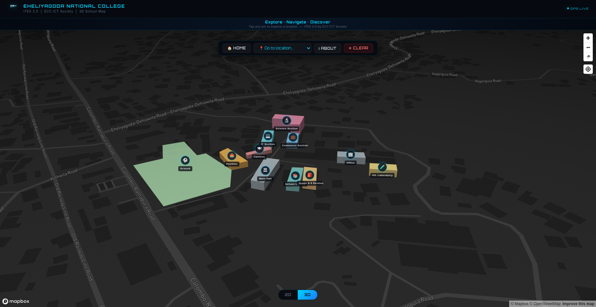

# ITEX 2.0 - Eheliyagoda National College 3D Map



**ITEX 2.0** is an interactive, fully responsive 3D school map designed for Eheliyagoda National College by the **ECC ICT Society**. It provides a modern, intuitive interface for students, teachers, and visitors to navigate the school campus in real-time.

## ✨ Features

- **Interactive 3D Campus:** Experience the school in 3D with extruded buildings that match the real-world scale and height of the campus architecture.
- **Custom Location Pins:** Tap on beautifully designed, floating 3D pins to learn more about specific buildings (Main Hall, School Library, O/L Laboratory, etc.).
- **Rich Popups:** Detailed popups for each location featuring an image, student capacity, number of floors, category, and description.
- **Real-Time GPS Navigation:** Get walking directions from your current location to any point on campus using the Mapbox Directions API and device geolocation.
- **2D / 3D Toggle:** Seamlessly switch between a top-down 2D view and an immersive 3D perspective.
- **Responsive Design:** Optimized for both desktop and mobile devices, ensuring a smooth experience for all users on the go.

## 🛠️ Technology Stack

- **Frontend:** HTML5, CSS3, JavaScript (Vanilla)
- **Map Engine:** [Mapbox GL JS v3.0.1](https://docs.mapbox.com/mapbox-gl-js/api/)
- **Styling:** Custom CSS with CSS variables, modern aesthetics, and fluid animations.
- **Typography:** Orbitron and Inter (Google Fonts).

## 🚀 Getting Started

### Prerequisites

To run this project locally, you will need a **Mapbox Access Token**. You can create one for free at [Mapbox](https://www.mapbox.com/).

### Installation

1. **Clone the repository:**
   ```bash
   git clone https://github.com/your-username/University-3D-Map.git
   cd University-3D-Map
   ```

2. **Configure Environment Variables:**
   Create an `env.js` file in the root directory and add your Mapbox access token. You can use the provided `env.example.js` as a reference:
   ```javascript
   const ENV = { 
       MAPBOX_TOKEN: 'pk.your_mapbox_access_token_here' 
   };
   ```

3. **Run the Project:**
   Since this is a static project, you can simply open `index.html` in your browser. Alternatively, you can run a local development server for a better experience (especially to avoid CORS issues with geolocation and Mapbox API requests):
   
   Using Node.js (`serve` or `http-server`):
   ```bash
   npx serve .
   ```
   Or using Python 3:
   ```bash
   python3 -m http.server
   ```

4. **Navigate to:** `http://localhost:3000` (or the port provided by your local server).

## 🏗️ Build Script

If you want to prepare the files for production deployment into a `public` directory, you can run the build script defined in `package.json`:

```bash
MAPBOX_TOKEN='your_token_here' npm run build
```
This will create a `public` folder, copy the necessary HTML and image files, and generate the `env.js` file automatically.

## 🎨 Design System

The UI was crafted with a modern "Cyber/Sci-Fi" aesthetic in mind. It uses deep dark backgrounds, bright cyan accents, glowing hover states, and glassy blur elements (`backdrop-filter`) to provide a premium feel.

## 👥 Credits

Developed by the **ECC ICT Society** for **Eheliyagoda National College**.

---
*Explore · Navigate · Discover*
